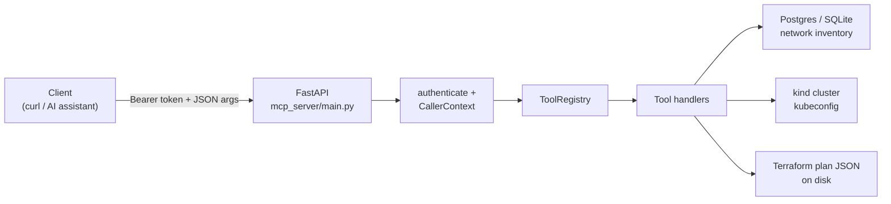

# NetPilot architecture

NetPilot is a FastAPI service that exposes a small set of infrastructure
inspection tools over HTTP. Tools are registered in a transport-agnostic
registry so the same handlers can later be served over a real MCP
transport without rewriting tool logic.

This document describes the system **as it exists today** (Milestone 2).
Milestone 3 will add the one mutating tool (`apply_remediation`) behind a
human-approval gate; nothing in that work is implemented yet.

## Tool registry

Tools live under `mcp_server/tools/`. Each tool is a plain Python function
plus two Pydantic models (arguments and result). The registry
(`mcp_server/tools/base.py`) stores a `ToolSpec` per tool:

- `name` / `description`
- `required_scope` (`read`, `plan`, or `mutate`)
- `args_model` (Pydantic) — used both for validation and for
  `input_schema()` advertised to clients
- `handler` — `handler(ctx, **parsed_args)`

`mcp_server/main.py` constructs a single `ToolRegistry`, registers every
tool, and expos
| HTTP | Purpose |
|---|---|
| `GET /mcp/tools` | Authenticated list of tools and their input schemas |
| `POST /mcp/tools/{tool_name}/call` | Authenticate, look up the spec, validate args, invoke the handler |

Handlers never talk HTTP. They receive a `CallerContext` and typed
arguments. That split is the whole point of the registry: swapping HTTP
for MCP later is a `main.py` change, not a tools change.

Every tool follows the same shape:

1. A module-level `REQUIRED_SCOPE` constant
2. Pydantic args and result models
3. `require_scope(ctx, REQUIRED_SCOPE)` as the first line of the handler
4. The rest of the body wrapped in `audit_call(...)`

## Auth and scopes

`mcp_server/auth.py` is the permission boundary. A caller presents a Bearer
token; `authenticate()` maps it to a `CallerContext` with a set of granted
scopes (from `NETPILOT_TOKEN_SCOPES`). A mismatch is a generic
"invalid or missing token" error — the audit log can distinguish unknown
vs wrong token; the HTTP response does not.

Scopes, low to hh privilege:

| Scope | Meaning | Tools today |
|---|---|---|
| `read` | Inspect state | `network_inventory`, `config_validate`, `k8s_inspect` |
| `plan` | Compute or analyze a proposed change without applying it | `tf_plan_analyze` |
| `mutate` | Apply a change | none (reserved for Milestone 3) |

`require_scope` is an exact-scope check: a token must hold the scope the
tool declares. `tf_plan_analyze` requires `plan` even though it does not
mutate anything, because Terraform plan JSON can leak infrastructure
topology.

Milestone 3 will keep this same model and add a **human-approval gate**
on the one mutating tool: holding `mutate` will not be enough by itself
to apply a change.

## Audit logging

`mcp_server/audit.py` writes one JSON line per tool call to
`AUDIT_LOG_PATH` (success or failure). Each line includes the tool name,
required scope, arguments, status, a short result summary, any error, and
duration. `audit_call` is a context manager: tools set
`record.result_summary` on the happy path; exceptions are recorded and
re-raised.

This is independent of chat history. After the fact you can answer "what
did the AI layer actually call" from the log file alone.

## Request path

- `network_inventory` / `config_validate` read the simulated network from
  SQLAlchemy (`DATABASE_URL`: SQLite by default, Postgres via
  `docker-compose`).
- `k8s_inspect` uses the official Kubernetes Python client against whatever
  kubeconfig is on the machine (a local `kind` cluster named `netpilot`
  in the documented setup). The server does not create the cluster.
- `tf_plan_analyze` parses an existing `terraform show -json` document.
  It never runs Terraform. The sample module in `infra/terraform/`
  targets LocalStack (also in `docker-compose.yml`).

## What is explicitly out of scope until Milestone 3

- Any tool that writes to the cluster, Terraform state, or the
  simulated network
- A human-approval / second-token gate for mutations
- A real MCP protocol transport (the registry is already shaped for it)
